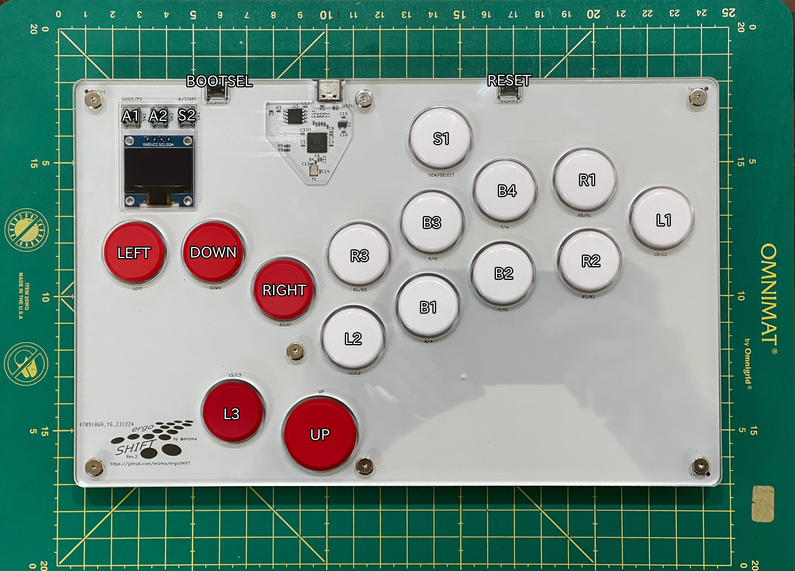

GP2040-CE Firmware
========================================================================

ergoSHIFT rev.2
------------------------------------------------------------------------

rev.2 uses [GP2040-CE firmware](https://gp2040-ce.info/).

Since the firmware build for ergoSHIFT is not available from
the project site, below are the information necessary to obtain the firmware.

### Prebuilt firmware file

If you would like to obtain the original GP2040-CE mainline builds, the firmware 
is available in their [Project Page](https://gp2040-ce.info/downloads) after v0.7.10.

Once you have downloaded the file, connect the board to your PC, 
when you see a USB thumbdrive mounted called `RPI-RP2`,
just drag and drop the firmware file. (You will need to hold down the `BOOT` button 
when you connect if you already have firmware written to it)

You may also obtain firmware with display layout enhancement by [adilahmeddev's branch](https://github.com/adilahmeddev/GP2040-CE-ERGOSHIFT-DISPLAY)
in [My fork repository releases](https://github.com/mizma/GP2040-CE/releases).

If you don't see the `RPI-RP2`, Hold down the `BOOT` button (the side tactile 
switch on the left) and press the `RST` button (the side tactile swith with
`SW_RST1` label).

### Building your own firmware

You can use the original [GP2040-CE repository](https://github.com/OpenStickCommunity/GP2040-CE) source to build firmware for ergoSHIFTRev2.

When building, set up the GP2040_BOARDCONFIG environment variable to `ergoSHIFTRev2`.
For how to build the firmware, follow the instructions in the original [GP2040-CE firmware](https://gp2040-ce.info/) website.

#### Pin assignments of ergoSHIFT Rev.2

Here are the Default Pinout and Button map information.

~~~C
// Main pin mapping Configuration
//                                // ergoSHIFT Rev.2 | GP2040 | Xinput | Switch  | PS3/4/5  | Dinput | Arcade |
#define GPIO_PIN_12 GpioAction::BUTTON_PRESS_UP     // UP     | UP     | UP      | UP       | UP     | UP     |
#define GPIO_PIN_09 GpioAction::BUTTON_PRESS_DOWN   // DOWN   | DOWN   | DOWN    | DOWN     | DOWN   | DOWN   |
#define GPIO_PIN_11 GpioAction::BUTTON_PRESS_RIGHT  // RIGHT  | RIGHT  | RIGHT   | RIGHT    | RIGHT  | RIGHT  |
#define GPIO_PIN_06 GpioAction::BUTTON_PRESS_LEFT   // LEFT   | LEFT   | LEFT    | LEFT     | LEFT   | LEFT   |
#define GPIO_PIN_18 GpioAction::BUTTON_PRESS_B1     // B1     | A      | B       | Cross    | 2      | K1     |
#define GPIO_PIN_19 GpioAction::BUTTON_PRESS_B2     // B2     | B      | A       | Circle   | 3      | K2     |
#define GPIO_PIN_23 GpioAction::BUTTON_PRESS_R2     // R2     | RT     | ZR      | R2       | 8      | K3     |
#define GPIO_PIN_16 GpioAction::BUTTON_PRESS_L2     // L2     | LT     | ZL      | L2       | 7      | K4     |
#define GPIO_PIN_20 GpioAction::BUTTON_PRESS_B3     // B3     | X      | Y       | Square   | 1      | P1     |
#define GPIO_PIN_25 GpioAction::BUTTON_PRESS_B4     // B4     | Y      | X       | Triangle | 4      | P2     |
#define GPIO_PIN_26 GpioAction::BUTTON_PRESS_R1     // R1     | RB     | R       | R1       | 6      | P3     |
#define GPIO_PIN_24 GpioAction::BUTTON_PRESS_L1     // L1     | LB     | L       | L1       | 5      | P4     |
#define GPIO_PIN_27 GpioAction::BUTTON_PRESS_S1     // S1     | Back   | Minus   | Select   | 9      | Coin   |
#define GPIO_PIN_00 GpioAction::BUTTON_PRESS_S2     // S2     | Start  | Plus    | Start    | 10     | Start  |
#define GPIO_PIN_10 GpioAction::BUTTON_PRESS_L3     // L3     | LS     | LS      | L3       | 11     | LS     |
#define GPIO_PIN_17 GpioAction::BUTTON_PRESS_R3     // R3     | RS     | RS      | R3       | 12     | RS     |
#define GPIO_PIN_02 GpioAction::BUTTON_PRESS_A1     // A1     | Guide  | Home    | PS       | 13     | ~      |
#define GPIO_PIN_01 GpioAction::BUTTON_PRESS_A2     // A2     | ~      | Capture | ~        | 14     | ~      |

#define HAS_I2C_DISPLAY 1
#define I2C_SDA_PIN 4
#define I2C_SCL_PIN 5
#define I2C_BLOCK i2c0
#define I2C_SPEED 400000
#define DISPLAY_FLIP 0      // set to 1 for southpaw
#define DISPLAY_INVERT 0

#define BUTTON_LAYOUT BUTTON_LAYOUT_STICKLESS
#define BUTTON_LAYOUT_RIGHT BUTTON_LAYOUT_STICKLESSB
#define SPLASH_MODE SPLASH_MODE_STATIC
#define SPLASH_CHOICE SPLASH_CHOICE_MAIN
#define SPLASH_DURATION 7500
~~~

### Setting for southpaw

You will need to change the Pin mapping and a few settings on the OLED Screen.
Using the Web Config is the easiest route.

* To enter Web Config, connect your board to a PC and press `RESET` while holding down `S2`
* Use a browser to access http://192.168.7.1/
    * If your Wifi, LAN or any other network is configured to use 192.168.7.* address,
      you may need to disconnect you Wifi/LAN while you configure your board.
* In the Configuration -> Pin Mapping change the following
    * Set PIN06 to `Right`
    * Set PIN11 to `Left`
* In the Configuration -> Display Configuration
    * Set Flip Display to `Flip and Mirror`

### Resetting firmware

If you have some issues with you firmware, you may want to reset the flash
memory first by dragging and dropping the [flash_nuke.uf2](./flash_nuke.uf2)
to the `RPI-RP2` and wait patiently until the `RPI-RP2` reconnects
